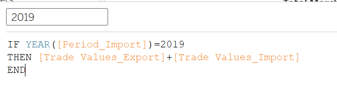
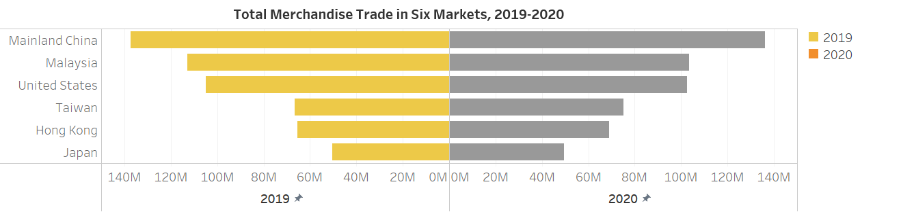

```{r setup, include=FALSE}
knitr::opts_chunk$set(echo = FALSE)
```

# 1. Overview

The original visualisation below is created by using [Merchandise Trade by Region/Market](https://www.singstat.gov.sg/find-data/search-by-theme/trade-and-investment/merchandise-trade/latest-data) data provided by Department of Statistics, Singapore (DOS). In this post, this visualisation will be evaluated in terms of clarity and aesthetics. Also, an makeover of this graph will be provided.


# 2. Critiques and Recommendations

### 2.1 **Clarity**
|**S/N** |          **Critiques**         |     **Comments**     |
|:--|:-----------------------------------------------|:--------------------------|
| 1  |Chart title is not precise – The title “Merchandise Trade of Top Six Trading Countries,2019-2020” does not convey the intent of the graph well. The chart refers to the merchandise trade of top six regions from 2019 to 2020, making it difficult to identify the ranking of the six markets quickly.      | Change title to “Merchandise Trade of Six Trading Regions from 2019 to 2020”. |
| 2  |The scale of X axis is not correct  –  The scale of X axis is from 2019 to 2021 that is inconsistent with the title of the graph. Also, the scale of values on X axis is year that is against the title of X axis.     | Modify the scale of X axis of the graph only from 2019 to 2020 as presented in the title of the graph and change the scale of values on X axis to be year of period.  |
| 3  |Inappropriate usage of graph – A area graph is not a suitable graphing method to show the values of both import and export merchandise trade of  regions. There are overlaps between the area of export and import merchandise trade, making it difficult to identify the information from export and import merchandise trade.      | It would be much clearer if using a line graph to show the merchandise trade. |
|4  |Lack of captions in the graph – Captions can provide brief explanations accompanying to the graph.     | Add captions at the bottom of the graph. |


### 2.2 **Aesthetics**
|**S/N** |          **Critiques**         |     **Comments**     |
|:--|:-----------------------------------------------|:--------------------------|
| 1  |The font size and location of each region label –  Font size of the label should be smaller than the title of the graph's. The location of the label should be at the center to indicate the related area graph clearly.      | Change the font size of the region label smaller than the font size of title and move the label to the center of each area graph. |
| 2  |Six area graphs are redundant –  It is not necessary to use six area graphs in the visualisation since the six area graphs have same coordinate axis and layouts. | Only keep one graph to show values with same coordinate axis and layouts.|
| 3  |Colors used to differentiate the import and export merchandise trade do not highlight the graph – Colors used should be with higher degree of contrast to easy highlight the graph.| Use colors with higher degree of contrast to differentiate the graph. |
|4  |Multiple unit measurements of Y axis used in the graph –  different unit measurements of Y axis may make readers be confused. | Keep the unit measurements of both Y axis and X axis uniform.  |


# 3. Proposed Design

{width=90%}

# 4. Data Visualisation Steps

### 4.1 **Data preparation**

**Data: Merchandise Imports By Region/Market, Monthly**

1. Remove unnecessary columns

Delete useless columns, only keep column Variables and columns from 2019 Jan to 2020 Dec using Excel.
{width=90%}


2. Remove useless rows

Remove unnecessary rows using Excel.
{width=90%}

3. Import into Tableau & Create data pivot

After importing data file into Tableau, the data from January 2019 to December 2020 are spread across multiple columns. Then, we can create a flat file to get a target view by selecting the columns from 2019 Jan to 2020 Dec, right click and selecting pivot.
{width=90%}

4. Rename column headers

Rename 'Variables' to 'Region_Import'. Rename 'Pivot Field Names' to 'Period_Import'. Rename 'Pivot Field Values' to 'Trade Values_Import'.
{width=90%}

5. Change data type

Change 'Region_Import' data type to 'Geographic Role - Country/Region'. Change 'Period_Import' data type to 'Date'. Change 'Trade Values_Import' data type to 'Number(Whole)'.
{width=90%}


**Data: Merchandise Exports By Region/Market, Monthly**

1. Tidy data and format data

Repeat steps 1 to 3 as done for data 'Merchandise Exports By Region/Market, Monthly' above.

2. Rename column headers

Rename 'Variables' to 'Region_Export'. Rename 'Pivot Field Names' to 'Period_Export'. Rename 'Pivot Field Values' to 'Trade Values_Export'.

3. Change data type

Change 'Region_Export' data type to 'Geographic Role - Country/Region'. Change 'Period_Export' data type to 'Date'. Change 'Trade Values_Export' data type to 'Number(Whole)'.


### 4.2 **Data visualisation**

**Visualisation for Merchandise import trade**

1. Create line chart

Drag [Period_import] and [Trade_Values_Import] to Columns and Rows respectively.
Click [Period_import] and select 'Quarter Year' type.
{width=90%}

2. Apply filter

Drag [Region_Import] to Filters panel, and check these 6 values: Mainland China, Hong Kong, Taiwan, Malaysia, Japan and United States.
{width=90%}

3. Apply colour

Drag [Region_Import] to colour,then click colour and select line with dot marker. The graph will be colored automatically.

{width=35%}

4. Rename axis

Rename y-axis to “Merchandise Trade Value”. Rename x-axis to "Quarter of Period".

5. Add title

Add title "Merchandise Import Trade in Six Markets, 2019-2020" using boldface.

6. Add Caption

Right click the graph and select "caption" to edit caption. Then the graph should shown as below.

{width=90%}

**Visualisation for Merchandise export trade**

Repeat steps 1 to 6 as done for data 'Visualisation for Merchandise import trade' above except using data from export table instead of data from import table.
{width=90%}


**Visualisation for Total Merchandise trade**

1. Create calculated field

Click 'Create calculated field' and input formula "IF Year([Period_Import])=2019 THEN [Trade_Values_Import]+[Trade_Values_Export] END" to create a new field named [2019]. 

Click 'Create calculated field' and input formula "IF Year([Period_Import])=2020 THEN [Trade_Values_Import]+[Trade_Values_Export] END" to create a new field named [2020]. 

{width=35%}{width=40%}

2. Create bar chart

Drag [2019],[2020] and [Region_Import] to Columns and Rows respectively.
Click X aixs of the 2019 to edit and select 'reversed' type for the axis.


3. Apply filter

Drag [Region_Import] to Filters panel, and check these 6 values: Mainland China, Hong Kong, Taiwan, Malaysia, Japan and United States.
{width=90%}


4. Apply colour

Click 'Color' to edit colour n the Marks pane for 2019 ar chart,then the graph will be colored automatically. 

{width=40%}


5. Add title

Add title "Total Merchandise Trade of Six Markets, 2019-2020" using boldface.
Then, the graph should shown as below.
{width=90%}

Full visualisation available at [Tableau Public](https://public.tableau.com/app/profile/zhang.youzhen/viz/makeover_1_16221982765090/Dashboard1)


# 5. Final Visualization

### 5.1 Snapshot of dashboard

{width=90%}


### 5.2 Major Insights

* Mainland China is the biggest merchandise trade market for Singapore among the six markets from 2019 to 2020, although the total merchandise trade volumn has a sight decline in 2020.


* The total merchandise trade volumns in Taiwan and Hong Kong markets keep increasing from 2019 to 2020, while the merchandise trade values for other four markets in 2020 are less than that in 2019.

* Merchandise trade in quarter four is always higher than that in other three quarters for Both Merchandise import trade and export trade.

* Both merchandise exports and imports in Japan market show a almost stable trend from 2019 to 2020.  

* Although merchandise import trade in Hong Kong is always lower than other markets, the merchandise export trade shows a increase trend from 2019 to 2020. The merchandise export trade volumn in Hong Kong markets is higher than other four markets except Mainland China market.

