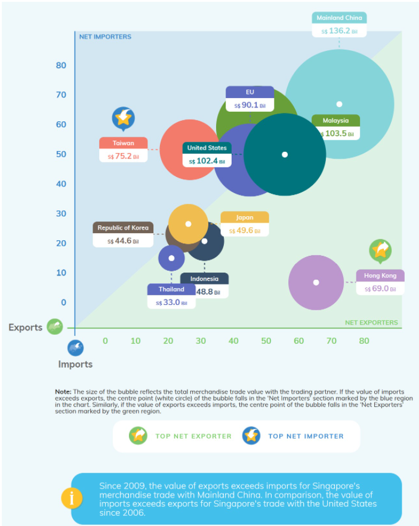

```{r setup, include=FALSE}
knitr::opts_chunk$set(echo = FALSE)
```

# 1. Overview

The original visualisation below is created by using [Merchandise Trade by Region/Market](https://www.singstat.gov.sg/find-data/search-by-theme/trade-and-investment/merchandise-trade/latest-data) data provided by Department of Statistics, Singapore (DOS). In this post, this visualisation will be evaluated in terms of clarity and aesthetics. Also, alternative graphical presentation will be provided to improve the current graph and give more meaningful insights.

The original design as shown below.
{width=90%}

# 2. Critiques and Recommendations

### 2.1 **Clarity**
|**S/N** |          **Critiques**         |     **Comments**     |
|:--|:-----------------------------------------------|:--------------------------|
| 1  | **Lack of a title to give a brief introduction for the visualisation** - A proper title that describe the intend of the graph well can help users to understand the visualisation easier and better.   | Add a title that can precisely convey the visualisation. |
| 2  | **The title for the Axis is misleading** - Just use import and export as the title for Y-axis and X-axis respectively is vague, users can not easily identify whether the value of axis is the actual merchandise trade volume or the percentage of merchandise trade volume.  | Use the proper title for both Y-axis and X-axis.   |
| 3  | **No indication of the Period for the merchandise trade volume** - The data source contains lots of merchandise trade data from 1976 to 2021, users can not be able to identify the period for the merchandise trade shown in the visualisation if no additional information to emphasize the specific period.     | Add information to clarify the period observed.  |
| 4  | **The conclusion information highlighted in the bottom of the visualisation can not be drawn based on the graph** - The year 2009 and 2006 are mentioned in the conclusion, but there is no related information shown in the graph.    | Clarify the period observed and make proper conclusions based on the visualisation.   |


### 2.2 **Aesthetics**
|**S/N** |          **Critiques**         |     **Comments**     |
|:--|:-----------------------------------------------|:--------------------------|
| 1  |      |       |
| 2  |      |       |
| 3  |      |       |
| 4  |      |       |


