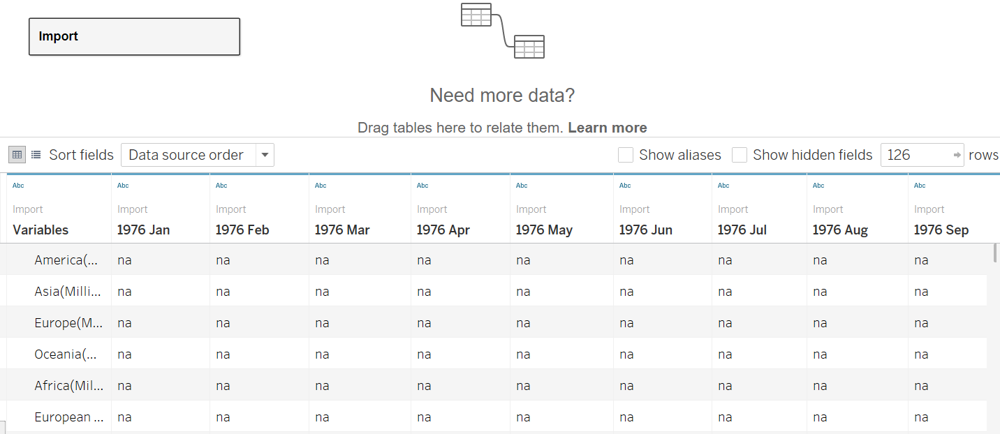
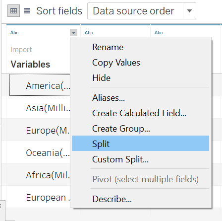
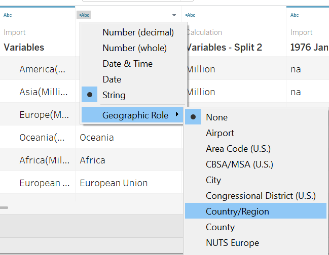

```{r setup, include=FALSE}
knitr::opts_chunk$set(echo = FALSE)
```

# 1. Overview

The original visualisation below is created by using [Merchandise Trade by Region/Market](https://www.singstat.gov.sg/find-data/search-by-theme/trade-and-investment/merchandise-trade/latest-data) data provided by Department of Statistics, Singapore (DOS). In this post, this visualisation will be evaluated in terms of clarity and aesthetics. Also, alternative graphical presentation will be provided to improve the current graph and give more meaningful insights.

The original design as shown below.
{width=90%}

# 2. Critiques and Suggestions

### 2.1 Clarity
|**S/N** |          **Critiques**         |     **Comments**     |
|:--|:-----------------------------------------------|:--------------------------|
| 1  | Lack of a title to give a brief introduction for the visualisation - A proper title that describe the intend of the graph well can help users to understand the visualisation easier and better.   | Add a title that can precisely convey the visualisation. |
| 2  | The title and value for the Axis is misleading - Just use import and export as the title for Y-axis and X-axis respectively is vague, users can not easily identify whether the value of axis is the actual merchandise trade volume or the percentage of merchandise trade volume.  | Use the proper title for both Y-axis and X-axis.   |
| 3  | No indication for the Period of the merchandise trade volume - The data source contains lots of merchandise trade data from 1976 to 2021, users can not be able to identify the period for the merchandise trade shown in the visualisation if no additional information to emphasize the specific period.     | Add information to clarify the period observed in the title or in the chart.  |
| 4  | The conclusion information highlighted in the bottom of the visualisation can not be drawn from the graph above - The year 2009 and 2006 are mentioned in the conclusion, but there is no related information shown in the graph. It is difficult for users to match the year and the merchandise trade according to the visualisation.  | Clarify the period observed and make proper conclusions based on the visualisation.   |
| 5 | The merchandise trade value shown with each bubble confused users easily - As users can not understand the value that may refer to either the import trade value or export trade value unless he read the notes carefully, then he can realize the value is referring to the total merchandise trade value.  | Clarify the value source in the title or in the tooltip. |


### 2.2 Aesthetics
|**S/N** |          **Critiques**         |     **Comments**     |
|:--|:-----------------------------------------------|:--------------------------|
| 1  | Colour palette used is glaring and not meaningful as it does not enhance the conveyance of information - |Use diverging color the show the bubble. For example, use red-blue diverging color to differentiate the value of total trade. |
| 2  | Some center points of bubble are obscured by the marker - The position of the center point of each bubble represents whether the value of import exceed the value of export for each market. Users can not get this information if the center point is obscured.   | Adjust the position of the marker to avoid keep some major information out or use different color for the border of the bubble to mark whether the import value exceeds to export value.  |
| 3  | The icon for 'Top net exporter' and 'Top net importer' under the note is not necessary, it can be added into the tooltip and shown with the marker in the chart directly. | Remove the Notation for the icon 'top net importer' and 'top net exporter', add the information into the tooltip.   |
| 4  | An static chart may not be the most appropriate chart - as there are lots of variables, including lots of trade markets, 2 trade type and periods of trade, it is difficult to gauge using a static chart.  |Instead of using a static chart, An interactive chart with filters can be used. |

# 3. Proposed Design


# 4. Data Visualisation Steps

### 4.1 Data preparation

1. Remove unnecessary rows

For both Import data and Export data, delete the top five rows to let the row for 'Variables' and 'the monthly period' to be the first rows and rename the data sheet 'Import' and 'Export' respectively using Excel.
{width=90%}


2. Import into Tableau 

After importing data file into Tableau, double click Import data file,then the detailed data would be shown on the right side.

{width=90%}

3. Remove the '(Million Dollars)' for Variables

Click the triangle sign on the left top of the 'Variables' column, then click split, the column would be split into two more columns. one is 'Variables - Split 1' and the other is 'Variables - Split 2'.

{width=40%}

the columns are as shown below after splitting.

{width=40%}


4. Change data type

Change the data type for Variables column by clicking the data type icon on the right top of this column, and select 'Geograhic Role' - 'Country/Region'.
{width=40%}

5. Change column name

Change the name of 'Variables - Split 1' to 'Markets' by clicking the name of this column.
{width=40%}


6. Hide columns 

Hide all the columns except the 'Markets' and the column from 'Jan 2011' to 'Dec 2020' by selecting the columns and right click, then clicking hide to hide columns.

{width=40%}


7. Create data pivot

Select columns from 'Jan 2011' to 'Dec 2020' at one time and right click, then click pivot.

{width=40%} 

the pivot is as shown.

{width=40%}


8. Change column name for pivot table

Change 'Pivot Field Names' and 'Pivot Field Values' column to 'Period' and 'Values' respectively by double click the column name.

{width=40%}


9. Change data type for pivot table

Change the data type for the 'Period' column to 'date' by clicking the data type icon on th right top of the column and select 'date'.

{width=40%}


10. Repeat steps 3 to 9 to prepare export data as done for import data.


### 4.2 Data visualisation


