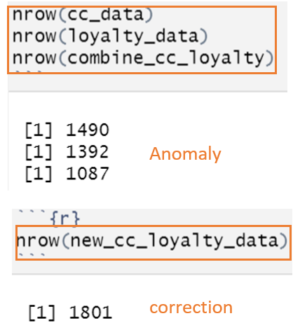
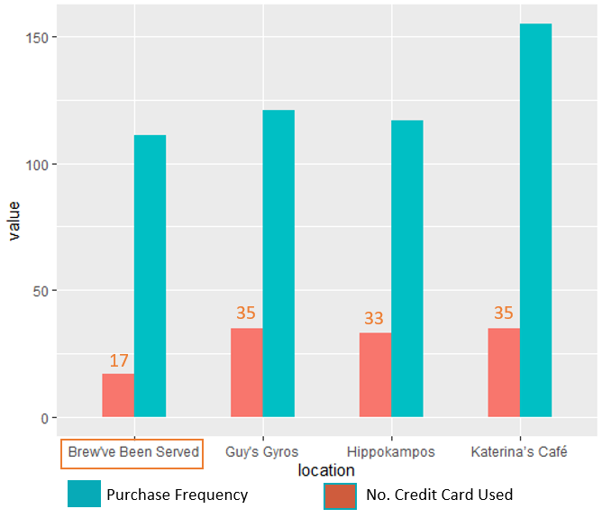

```{r setup, include=FALSE}
knitr::opts_chunk$set(fig.retina = 3,
                      echo = TRUE,
                      eval = TRUE,
                      message = FALSE,
                      warning = FALSE)
```

# 1. Introduction

### 1.1 Backgroud of the case

Several employees of GAStech go missing, the case is under investigation.

Many of the Abila, Kronos-based employees of GAStech have company cars which were installed geospatial tracking software to track data periodically as long as they are moving.

This vehicle tracking data has been made available to law enforcement to support their investigation. Unfortunately, data is not available for the day the GAStech employees went missing. Data is only available for the two weeks prior to the disappearance.

Also, Kronos based companies provide a Kronos Kares benefit card to GASTech employees giving them discounts and rewards in exchange for collecting information about their credit card purchases and preferences as recorded on loyalty cards. This data has been made available to investigators in the hopes that it can help resolve the situation.

### 1.2 Objectives of this report

The objectives of this case analysis report is to identify which GASTech employees made which purchases and identify suspicious patterns of behavior. 
During the analysis, 3 aspects were taken into consideration:

1. Using just the credit and loyalty card data, identify the most popular locations, and when they are popular. Also, recommendations should be given to correct these anomalies.

2. Add the vehicle data to analysis of the credit and loyalty card data and figure out the discrepancies between vehicle, credit, and loyalty card data.

3. Infer the owners of each credit card and loyalty card and provide the evidences for that.

# 2. Literature Review

In the literature review conducted, it was found that there were some geospatial data in the datasets. To delivery a clear analysis based on tracking movement trace, I examined how to visualise movement data by using appropriate R packages. Also, as there were two card datasets provided for analysis and we need to explore the relationships between two kind of cards, I examined how join and merge tables by using appropriate R packages. Besides, I
did some research about ggplot packages in order to plot some appropriate charts to visualisation.

To get a better understanding about the relationship between employee and credit card, some network data visualisation and analysis techniques would be used. For example, build network graph visualisation using appropriate functions of ggraph.

# 3. Data Preperation

### 3.1 Install and load packages

We need to set up the environment and load all required packages first. The code chunk below will install the packages if not yet installed, and load them to the environment.

```{r}
packages = c('ggiraph', 'plotly', 'DT', 'patchwork','plyr',
             'tidyverse','raster', 'sf', 'igraph', 'tidygraph', 
             'ggraph', 'visNetwork', 'rgdal',
             'lubridate', 'clock','tmap','rmarkdown')

for (p in packages){
  if(!require(p, character.only = T)){
    install.packages(p)
  }
  library(p,character.only = T)
}
```

### 3.2 Import data

The data was loaded using read.csv() of the readr package, which reads delimited files into a tibble.

```{r}
cc_data <- read.csv("MC2/cc_data.csv")
loyalty_data <- read.csv("MC2/loyalty_data.csv")
gps <- read.csv("MC2/gps.csv")
```

### 3.3 Data processing

1. Change variables to the proper data type and create new variables for further analysis.

```{r}
cc_data$timestamp <- date_time_parse(cc_data$timestamp,
                                 zone = "",
                                 format = "%m/%d/%Y %H:%M")

cc_data$date <- substr(cc_data$timestamp,1,10)

cc_data$date <- date_parse(cc_data$date,format = "%Y-%m-%d")

loyalty_data$date <- date_parse(loyalty_data$timestamp,
                                format = "%m/%d/%Y")
```

2. Combine credit card data and loyalty card data into a new data frame based on the same location, timestamp and price in order to identify the most popular place and the most popular timeslot. Also, rename the columns for the new data frame.

```{r}
combine_cc_loyalty = cc_data %>% inner_join(loyalty_data,
                                          by=c('location','price','date'))
sum_by_location <- combine_cc_loyalty %>%
select(location, price) %>%
group_by(location) %>%
summarise(total_price = sum(price), total_count = n()) %>%
arrange(desc(total_count), desc(total_price))

colnames(combine_cc_loyalty)[1] <- "timestamp"
```


# 4. Data analysis and visualisation

### 4.1 Most popular location

we identify the most popular locations based on shopping frequency and the amount of money spent. 

```{r}
ggplot(sum_by_location, aes(x = location)) +
  geom_col(aes( y = total_count, fill="steelblue")) +
  scale_y_continuous(name = "Frequency") +
  scale_fill_manual('', labels = 'Frequency', values = "steelblue") +
  theme(axis.text.x = element_text(angle = 90),legend.position="bottom")
```

### 4.2 Most popular timeslot

Based on the most popular location, we explore the most popular time people visit in 24 hours each day using heatmap graph, the darker the color is, the more popular the place is in this timeslot.

```{r}
popular_time <- combine_cc_loyalty %>%
  select(location,date,timestamp,price) %>%
  filter(location == "Katerina’s Café"|location == "Guy's Gyros" |location == "Hippokampos"|location == "Brew've Been Served") 

popular_time$hour <- hour(popular_time$timestamp)

popular_time_count <- popular_time %>%
  group_by(location,date,hour) %>%
  summarise(frequency = n())

popular_time_count <- popular_time_count %>%
  right_join(expand.grid(location = unique(popular_time$location),
                       date = unique(popular_time$date),
                       hour = c(1:23)),
             by =c('location','date','hour')) %>%
  replace_na(list(frequency = 0L))

ggplot(popular_time_count,aes(date, hour, fill= frequency)) + 
geom_tile(color = 'white',size = 0.1) + 
  facet_grid(~location) +
   scale_fill_distiller(palette = "orange",direction = 1)+
  scale_x_date(breaks = popular_time_count$date[seq(1, length(popular_time_count$date), by = 2)])+
  scale_y_continuous(breaks = seq(1,24,2)) +
  theme(axis.text.x = element_text(angle = 90),legend.position="bottom")
```

### 4.3 Anomalies about credit card and loyalty data

1. As loyalty cards data is always generated from credit cards data, both the data should be same by right. However, the some transactions data in credit card dataset are not consistent with the data in loyalty dataset. There are 1490 and 1392 transactions in credit card dataset and loyalty dataset respectively. Also, just 1087 transactions can match based on the location, timestamp and price spent for each transaction.

```{r}
nrow(cc_data)
nrow(loyalty_data)
nrow(combine_cc_loyalty)
```

2. All the transactions happened at Brew've Been Served were paid around 17 different credit cards. That means just 17 people always went there. It is less than other three popular locations which have 33 or 35 different visitors in the last two weeks. 

```{r}
visitor_count_for_location <- combine_cc_loyalty %>%
  select(location,last4ccnum) %>%
  filter(location == "Katerina’s Café"|location == "Guy's Gyros" |location == "Hippokampos"|location == "Brew've Been Served") %>%
  group_by(location,last4ccnum) %>%
  summarise(total_count = n()) %>%
  select(location) %>%
  group_by(location) %>%
  summarise(count_credit_cards=n()) %>%
  left_join(sum_by_location,by = c('location')) %>%
  select(location, count_credit_cards,total_count) %>%
  gather(count_credit_cards, total_count, key = "key", value = "value")

ggplot(visitor_count_for_location, aes(x = location)) +
  geom_col(aes( y = value, fill=key),position = "dodge",width = .5)
```

3. Although employees always went Katerina’s Café, Guy's Gyros, Hippokampos and Brew've Been Served, they did not spend too much money there. On the contrary, employees spent more at Abila Airport, Nationwide Refinery, Carlyle Chemical Inc. and Stewart and Sons Fabrication even though they did not purchase there frequently.

```{r}
ggplot(sum_by_location, aes(x = location)) +
  geom_col(aes( y = total_count, fill="steelblue")) +
  geom_line(aes(y = total_price/500, group = 1, color = 'orange')) +
  geom_point(aes(x=location, y=total_price/500, color="orange"))+
  scale_y_continuous(name = "Frequency", sec.axis = sec_axis(trans = ~ .* 500,name = "Price")) +
  scale_fill_manual('', labels = 'Frequency', values = "steelblue") +
  scale_color_manual('', labels = 'Total Price', values = 'orange') +
  theme(axis.text.x = element_text(angle = 90),legend.position="bottom")
```


### 4.4 Recommandations for correcting anomalies

1.Merge the transactions exiting in loyalty card data but not exiting in the credit card data to the credit card data in order to make up the missing transactions in credit card data.

```{r}
new_cc_data <- merge(cc_data, combine_cc_loyalty,
                              by=c('timestamp','location','price','last4ccnum'),all=TRUE)

new_cc_data <- new_cc_data[-c(488,497,507,513,674,683),] %>%
  select(timestamp,location, price,last4ccnum,date.x,loyaltynum)

colnames(new_cc_data)[5] <- "date"

new_loyalty_data <- merge(loyalty_data, combine_cc_loyalty,
                              by=c('date','location','price','loyaltynum'),all=TRUE)

new_loyalty_data <- new_loyalty_data[-c(610,412,465,415,612,468),] %>%
  select(date,location, price,last4ccnum,loyaltynum)

new_cc_loyalty_data <-  union(left_join(new_cc_data, new_loyalty_data),
                              right_join(new_cc_data, new_loyalty_data))

glimpse(new_cc_loyalty_data)
```


### 4.5 Add vehicle data to the analysis of the credit and loyalty card data


### 4.6 Discrepancies between vehicle, credit, and loyalty card data 

1. Add the vehicle data to the analysis of the credit and loyalty card data,

```{r}
bgmap <- raster("MC2/MC2-tourist.tif")

tm_shape(bgmap) +
tm_rgb(bgmap, r = 1,g = 2,b = 3,
alpha = NA,
saturation = 1,
interpolate = TRUE,
max.value = 255)

Abila_st <- st_read(dsn = "MC2/Geospatial",
layer = "Abila")

gps$Timestamp <- date_time_parse(gps$Timestamp,
zone = "",
format = "%m/%d/%Y %H:%M:%S")

gps$day <- as.factor(get_day(gps$Timestamp))

gps_sf <- st_as_sf(gps,
coords = c("long", "lat"),
crs= 4326)

gps_path <- gps_sf %>%
group_by(id, day) %>%
summarize(m = mean(Timestamp),
do_union=FALSE) %>%
st_cast("LINESTRING")
```


2. add path
```{r}
gps_path_selected <- gps_path %>%
filter(id==35)
tmap_mode("view")
tm_shape(bgmap) +
tm_rgb(bgmap, r = 1,g = 2,b = 3,
alpha = NA,
saturation = 1,
interpolate = TRUE,
max.value = 255) +
tm_shape(gps_path_selected) + tm_lines()
```


### 4.6 Mapping credit card and loyalty card

Mapping the credit card and loyalty card data based on the transactions with same location, transaction timestamp and price.

```{r}
cards_mapping <- new_cc_data %>%
select(last4ccnum,loyaltynum) %>%
filter(loyaltynum>0) %>%
group_by(last4ccnum,loyaltynum) %>%
summarise(total_count = n()) %>%
arrange(desc(total_count))

cards_mapping_cc <- cards_mapping %>%
  summarise(no_count=n())
```


# 5. Insights

### 5.1 Most popular location and timeslot

1. Most popular locations
Katerina’s Café, Guy's Gyros, Hippokampos and Brew've Been Served are the places people go and visit most. Because more transactions were produced there.

{width=90%}

2. Most popular timeslots
For Katerina’s Café, Guy's Gyros and Hippokamposmost, most of employees went there around 13pm to 15pm and 19pm to 21pm each day. For Brew've Been, people always went there around 7am to 8am on the weekdays.

{width=90%}


### 5.2 Anomalies and corrections for credit card and loyalty card data

1. Transactions of credit card are inconsistent with loyalty cards'.

As loyalty cards data is always generated from credit cards data, both the data should be same by right. However, the some transactions data in credit card dataset are not consistent with the data in loyalty dataset. There are 1490 and 1392 transactions in credit card dataset and loyalty dataset respectively. Also, just 1087 transactions can match based on the location, timestamp and price spent for each transaction.

To correct this issue, we can merge the transactions exiting in loyalty card data but not exiting in the credit card data to the credit card data in order to make up the missing transactions in credit card data, then we can get a more comprehensive transaction data for purchases and preferences. Because the reason for the inconsistency might be that some employees did not record transactions on loyalty card although they indeed purchase something using their credit card. For the same reason, some employees recorded the purchase on their loyalty card but they did not pay that using given credit card.

{width=20%}


2. There are just 17 credit cards which were used frequently at Brew've Been Served on weekdays around 7am to 9am, far less than that of other three popular locations.

{width=60%}

For Brew've Been Served anomaly, we can follow up the employees who owned these credit cards to identify their relationships.


3. Most popular locations are different with the locations with higher purchase amount.

Although employees always went Katerina’s Café, Guy's Gyros, Hippokampos and Brew've Been Served, they did not spend too much money there. On the contrary, employees spent more at Abila Airport, Nationwide Refinery, Carlyle Chemical Inc. and Stewart and Sons Fabrication even though they did not purchase there frequently.

{width=90%}

For this issue, we can  category the location to explore the transactions produced by different business. Because the price of a order may vary from business to business.


### 5.3 


